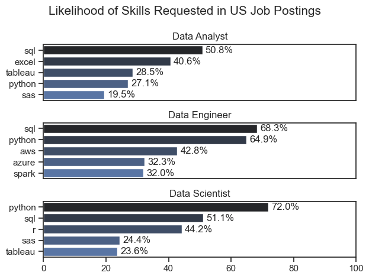
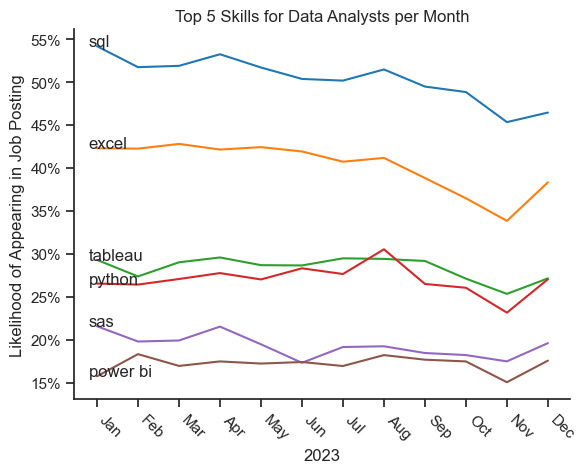
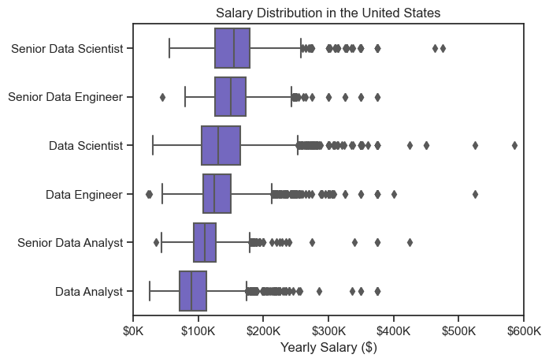
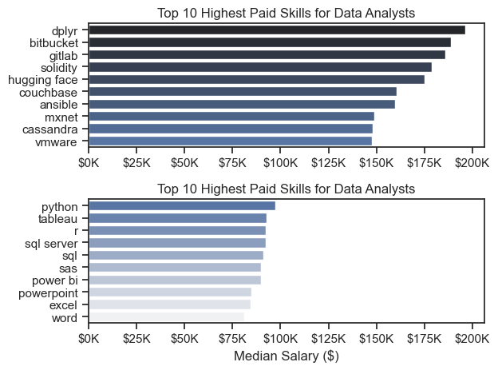
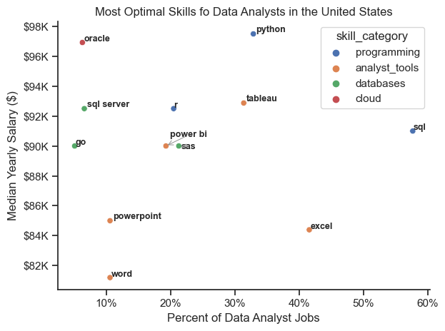

# Overview

This is an analysis of the data job market focused on data anaylst roles. This project was completed in order learn how to use Python in the context of data analysis. It also helps me better understand the data job market and learn what skills are important to learn or improve.

# The Questions

Below are questions I answered in my project:

1. What are the skills most in demand for the top 3 most popular data roles?
2. How are in-demand skills trending for Data analysts?
3. How well do jobs an skills pay for Data Analysts?
4. What are the optimal skills for Data Analysts to learn? (High demand AND High Paying)

# Tools I Used

- **Python:** The backbone of my analysis, allowing me to analyze the data and find critical insights. I also utilized the following libraries:
  - **Pandas Library:** Used to analyzed the data
  - **Matplotlib Library:** Used to visualized the data.
  - **Seaborn Library:** Used to create more advanced visuals.

# The Analysis

## 1. What are the most demanded skills for the top 3 most popular data roles in the United States?

To find the most demanded skills for the top 3 most popular data roles, I first filtered for only roles in the United States. Then I looked at the top skills for each job role, and took the top 5 of those skills. From there I narrowed things down to only the top 3 skills. This highlights the importance of each skill in each data role, and can help job seekers more effectively target skills they need to learn or improve on.

View my notebook with detailed steps here:
[2_Skills_Demand.ipynb](3_Project/2_Skills_Demand.ipynb)

```python
df_skills = df_US_DA.explode('job_skills').copy()

# Count how many times each skill appears for each job title
df_skills_count = (
    df_skills
    .groupby(['job_title_short', 'job_skills'])
    .size()
    .reset_index(name='skill_count')
)

# Total number of job postings for each job title
total_jobs = df_US_DA.groupby('job_title_short').size()

# Map the totals onto the skills dataframe
df_skills_count['total_jobs'] = df_skills_count['job_title_short'].map(total_jobs)

# Calculate percentage
df_skills_count['skill_percent'] = (
    df_skills_count['skill_count'] / df_skills_count['total_jobs'] * 100
).round(1)

# Optional: sort by percentage
df_skills_count = df_skills_count.sort_values(
    by=['job_title_short', 'skill_percent'],
    ascending=[True, False]
)
```

### Results


_Graph visualizing the top 5 skills in the roles, Data Analyst, Data Enginer and Data Scientists, which are the top 3 data jobs_

### Insights

- SQL and Python are highly demended across all three roles, but especially so in Data Engineer and Data Scientist roles.
- Tableau also ranks high, appearing in around 1/4 of the jobs for both Data Analysts and Data Scientists.
- Data Engineers require more specialized technical skills (AWS, Azure, Spark) compared to Data Analysts and Scientists, who foucs on more general data management and analysis tools.

## 2. How are in-demand skills trending for Data Analysts?

### Visualize Data

```python
# Convert counts → percentage of jobs that month
df_US_pivot = df_US_pivot.div(monthly_totals, axis=0) * 100

# Sort the skills by total demand (using the percentage totals)
df_US_pivot.loc['Total'] = df_US_pivot.sum()
df_US_pivot = df_US_pivot[df_US_pivot.loc['Total'].sort_values(ascending=False).index]
df_US_pivot = df_US_pivot.drop('Total')

# Use month names for plotting
df_US_pivot = df_US_pivot.reset_index()
df_US_pivot['job_posted_month'] = df_US_pivot['job_posted_month_no'].apply(
    lambda x: pd.to_datetime(x, format='%m').strftime('%b')
)
df_US_pivot = df_US_pivot.set_index('job_posted_month')
df_US_pivot = df_US_pivot.drop(columns='job_posted_month_no')
```

### Results


_Line graph visualizing the trending top skills for data anayslts in the United States in 2023_

### Insights:

- SQL remains the most demanded skill throughout the year. It dips a bit near near the end of the year.

- Tableau and Python appear at around the same rate and hold consistent demand throughout the year, showing that they are important skills to have.

- Most skills (especially SQL and Excel) show a clear dip in October–November, followed by a rebound in December. This demonstrates that all of these skills are still in demand and are not at risk of being phased out for newer skills.

## 3. How well do jobs and skills pay for Data Analysts?

### Salary Distribution Analysis

#### Visualize Data

```python
sns.boxplot(
    data=df_top_6,
    x='salary_year_avg',
    y='job_title_short',
    order=job_order,
    color='slateblue',
)

sns.set_theme(style='ticks')
plt.title('Salary Distribution in the United States')
plt.ylabel('')
plt.xlabel('Yearly Salary ($)')
plt.xlim(0, 600000)
ax = plt.gca()
ax.xaxis.set_major_formatter(
    plt.FuncFormatter(
        lambda  x, pos: f'${int(x/1000)}K'
    )
)
plt.show()
```

#### Results


_Box plot visualizing the salary distribution for the top 6 data job titles_

#### Insights

- More specialized roles like Data Scientists and and Data Engineers have higher median salaries, surpassing even Senior Data Analysts. They also have a wider variability in salary.

- Both Data Scientists and Senior Data Scientists have significantly high outliers than other roles. By contrast Data Analysts have lower outliers, showing that the salaries are more consistent.

- Median Salary inceases as seniority and the need for specialized skills increase. This incrase is accompanied by a larger degree of variance between the top paying jobs and the lower paying jobs.

### Highest Paid vs Most Demanded Skills fo Data

### Visualize Data

```python
fig, ax = plt.subplots(2, 1)

# Top 10 Highest Paid Skills
sns.barplot(
    data=df_top_pay,
    x='median_salary',
    y=df_top_pay.index,
    ax=ax[0],
    palette='dark:b'
)
# Top 10 In-Demand Skills
sns.barplot(
    data=df_top_skills_count,
    x='median_salary',
    y=df_top_skills_count.index,
    ax=ax[1],
    palette='light:b_r'
)

fig.tight_layout()
plt.show()
```

#### Results


_Bar plot visualizing the top paying skills vs the pay or the most in-demand skills_

#### Insights

- Top paying skills offer significantly higer pay, but are significantly less in-demand. The most demanded skills by comparison are lower paying, but have significantly more job opportunities.

- Programming and visualization skills offer a good mix of high pay and high demand compared to foundational skills like Excel, Word and PowerPoint. Despite the lower demand though the foundational skills are still highly desired, highlighting their importance.

## 4. What are the most optimal skills to learn for Data Analysts?

### Setting up the data

```python
# Calculate the average salary and job count of job postings per skill, and limit top skills
skills_count = df_skills_exploded.groupby('job_skills').agg(
    median_salary=('salary_year_avg', 'median'),
    skill_count=('salary_year_avg', 'size')
).sort_values(by='skill_count', ascending=False)

# Total number of job postings for each job title
total_jobs = df_US_DA.groupby('job_title_short').size()

# Get percent of jobs skills appear in
skills_count['skill_percent'] = round(skills_count['skill_count'].div(total_jobs[0]) * 100, 1)

top_skills = 12
skills_count = skills_count.head(top_skills)
```

### Results


_Scatter plot visualizing the salary distribution vs the percent of analyst jobs skills appear in_

### Insights

- `Programming` skills (colored blue) such as Python and SQL occupy the upper right portion of the scatter plot. Earning higher salaries and appearing in a larger percentage of jobs, these skills are important skills learn or improve.

- `Analyst Tools` (colored orange) such as Power BI and Tableau appear a high percentage of job postings and offer a relatively high salary, showing the importance of visualization tools.

- `Database` and `cloud` skills offer very high salaries, but appear in fewer jobs. While very specialized these roles are valued highly in the data field.

# What I Learned

I got experience using Python to help analyze the data job market and enhanced my skills. I learned that Python is quite versatile, being capable of both cleaning, manipulating and visualizing data. Libraries such as Pandas can be used for data manipulation and Seaborn and Matplotlib can be used for data visualizaton.Other specialized libraries, such as adjustText can be used to improve visualizations.

# Challenges I Faced

- In the final project dealing with the most optimal skill, adjustText stopped working, so I needed to trouble shoot what was wrong. Using Grok and Chat GPT, I was able to narrow down the issue and correct it.

- Manipulating the data to provide what I needed. For example, in some visualizations percent of jobs is used rather than just the count of jobs. Figuring out how to do this on my own, before watching how it was done, provided a nice challenge, that gave me better insights into how Python works.

# Conclusion

This exploration into he data analyst job market has highlighted the critical skills and trends that shape this evolving field. It has also given me a look into how Python can be used in data analysis and helped me start developing a skill that will prove useful in my job search.
